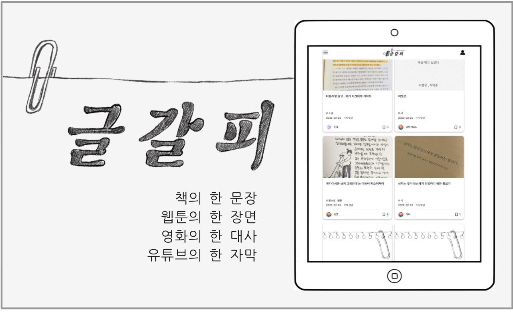

 

# <strong>글갈피</strong>

  <a target="_blank" href="https://www.youtube.com/watch?v=n_hyLleY9Vs&t=1s">
    
    
(클릭하면 영상을 실행할 수 있습니다)

  </a>

 
 

'나' 에게는 내가 좋아하는 글들을 저장할 수 있고, '남' 에게는 새로운 도서, 콘텐츠들을 접할 수 있는 서비스

 
 
  <a target="_blank" href="https://writingmark.netlify.app/">
    
>> 글갈피 구경하기 <<

    </a>
 
 
 

## ⭐️ 프로젝트 소개

**프론트 1명, 백엔드 1명으로 팀을 이루어 기획 - 디자인 - 개발 - 배포 진행**

- 프로젝트 기간 : 2021.12.22 ~ 2022.02.20

- <a href="https://unmarred-viscose-9b2.notion.site/27e95a52fcfd4b1c952e0cdccbca409b">
기획서 보기
</a>
- <a href="https://kk-studio.notion.site/API-document-0f1c0b63e49c47bf8fe124e8216cae03">
API 문서 보기
</a>
   

한 마디로 천 냥 빚을 갚는다, 처럼 한 마디, 한 줄의 글은 강한 임팩트를 남깁니다.
책에 대한 열 가지의 설명 보다 책 속에 적힌 한 문장으로 인해 책을 보게 되거나, 대사 하나로 인해 영화의
줄거리에 관심을 갖고 보게 되는 경우도 있죠. 글이 될 수도 있고, 대사가 될 수도 있으며, 그림이 될 수도 있습니다.
**내게 와닿았던 한 부분을 남에게 공유하는 서비스**입니다.
 

 
 

## 기술 스택

| JavaScript | TypeScript |  React   |  Redux Saga   |  styled components   |
| :--------: | :--------: | :------: | :-----------: | :------------------: |
|   ![js]    |   ![ts]    | ![react] | ![redux-saga] | ![styled-components] |

 
 

## 💁‍♂️ 담당한 기능

- 사이트 전체 UI 및 반응형 웹 구현
- 소셜로그인과 사용자 인증 토큰 관리
- 비회원 사용제한 알림
- Intersection Observer을 사용한 무한스크롤
- 북마크(좋아요) 기능
- 게시글 신규 / 인기 순으로 정렬
- 게시글 작성 / 수정 / 삭제
- 댓글 작성 / 수정 / 삭제
- 자기 작성글 + 찜 목록 보기
- 프로필 이미지 수정 + 삭제
- 이메일, 닉네임, 비밀번호 변경
- 회원탈퇴

<!-- Stack Icon Refernces -->

[js]: public/stack/javascript.svg
[ts]: public/stack/typescript.svg
[react]: public/stack/react.svg
[redux-saga]: public/stack/redux-saga.svg
[styled-components]: public/stack/styled-components.svg
